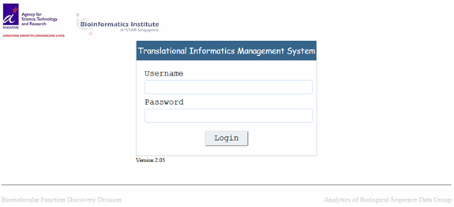

# TIMS Automated Installation Guide

1.	The user who is going to install TIMS needs to have administrative right on the machine.

2.	Copy the installation script (i.e. TIMS_Installation.sh) into your home directory (e.g. /home/admin if your user name is admin)

3.	Make the script executable: `chmod +x TIMS_Installation.sh`

4.	Since the installation require administrative privilege, you may want to keep your "sudo" session last a bit longer than default which is 30 minutes, in order to prevent the installation from keep asking for password when the session timeout. To edit the sudoers timeout session, please follow the steps below:
	- On the command prompt, please type: `sudo visudo`
	- Please change the line:
		Defaults `env_reset` To Defaults `env_reset,timestamp_timeout=300` [Note: if you never want a password prompt, you can change the timestamp_timeout to -1, but this is not recommended]
	- Press `Ctrl+X` and then `Y` to finish editing and save changes. 
	- Please exit the Terminal and reopen it. [Note: after finish installation, you may want to change back the timestamp_timeout to default]

5.	Run the script from your home directory: `./TIMS_Installation.sh |& tee output.txt`

6.	The output from the installation will be stored in output.txt

7.	The script took around 5 hours to run (depending on your internet speed.)

8.	Things to note during the installation:
	- You will be prompt for user password a couple of times.
	- When prompt to change MySQL password, just press enter.
	- When with the option of yes|no, just enter yes.

9.	Once the installation is completed, your computer will be reboot.

10.	Open a new Terminal and start the glassfish and mysql servers. On the command prompt, type:
	- `asadmin start-domain`
	- `sudo service mysql start`

11.	Please make sure your /etc/hosts file has been setup properly i.e. it contain the following line:
Your_IP_Address	Your_Hostname

12.	In order for TIMS to send out the status email, please ensure that the SMTP server is being installed.

13.	You can now access TIMS through the following link:
http://your-machine-ipaddress:8081/TIMS/login.xhtml

14.	Below is a screenshot of TIMS: 

## Initial setup at TIMS
1.	A user (tims-admin) with administrative right has been created for you. Please login to TIMS using the default password (i.e. password).

2.	The following institution, department and group have been created for you:
	- TIMS `Institute`
 	- TIMS `Department`
	- TIMS `Group`

3.	A PI (tims-pi) in-charge of TIMS Group has been created for you. Please login using the default password (i.e. password).

4.	You may proceed to create a study under TIMS Group; a study needs to be created before you could upload any data and run the pipelines in TIMS.

## Downloading dataset for testing
1)	Please download the test dataset from https://figshare.com/articles/TestData_tar/9083936

2)	The file TestData.tar contains test data for the five different pipelines, i.e.
	* `Gene Expression` Pipeline (Affymetrix)
  	  * Folder name: GEx
		*  Raw files inside "CEL-files" folder
		*  Samples' annotation file: samples-annot-GEx.txt
	* `Methylation` Pipeline
	  * Folder name: Methylation
		* Raw files inside "idat-files" folder
		* Samples' annotation file: samples-annot-Methylation.txt
	* `GATK Whole-Genome Sequencing (Germline Mutation)` or `GATK Targeted Sequencing (Germline Mutation)` 
	  * Folder name: DNAseq-Germline
	    * Raw files inside "BAM-files" folder
	    * Samples' annotation file: samples-annot-Exome.txt
	    * Interval file: interval.bed
	* `GATK Whole-Genome Sequencing (Somatic Mutation)` or `GATK Targeted Sequencing (Somatic Mutation)`
	  * Folder name: DNAseq-Somatic
		* Raw files inside "BAM-files" folder
		* Samples' annotation file: samples-annot-Exome.txt
		* Interval file: interval.bed
	* `RNA Sequencing` Pipeline
	  * Folder name: RNAseq
		* Raw files inside "BAM-files" folder  
Note: BAM files were generated by aligning the FASTQ files to the refseq transcript sequences of the provided GTF file. As the RNA-seq pipeline utilized RSEM for mRNA quantification, the BAM files should be aligned to transcript sequences instead of the genome reference.
		* Samples' annotation file: samples-annot-RNAseq.txt
		* Transcript annotation (GTF file): hg19-refseq.gtf

3)	The meta-data comes together with the file TestData.tar and it is archived under the file Metadata.zip 
	* Please unzip the file Metadata.zip, you should be able to find three files, i.e.
	  * core_data_column_id_tag.xlsx
	  * study_specific_fields.xlsx
	  * meta-data.xlsx
	* Please follow the user guide (documentation) on TIMS for the details on how to upload metadata   
Please note that this metadata is only applicable for the testing data of four pipelines, i.e. Gene Expression pipeline (Affymetrix), Methylation450K pipeline, GATK Whole-Genome or Targeted Sequencing (Germline Mutation) pipeline and RNA Sequencing Pipeline. 

4)	Please follow the user guide (documentation) on TIMS for the details on how to submit job. 

## Enabling GISTIC for CNV analysis
The copy number variation pipeline is GISTIC ready, however, due to licensing issue, it has not been distributed together with the installation files. In order to enable GISTIC for copy number variation pipeline, you will need to install and enable GISTIC separately.

Please download GISTIC from: http://portals.broadinstitute.org/cgi-bin/cancer/publications/pub_paper.cgi?mode=view&paper_id=216&p=t

The installation instruction is available at: `ftp://ftp.broadinstitute.org/pub/GISTIC2.0/INSTALL.txt`

Currently, the pipeline is tested for GISTIC v2.0.22. 

The GISTIC installation directory should be on /var/pipelines/TIMS/programs/GISTIC2.0/. In order to run GISTIC, you will need to install Matlab compiler runtime which come together with the GISTIC package. Please install the Matlab compiler runtime at the default directory which is at "/opt/MATLAB/Matlab_Compiler_Runtime/".

## Software installed by the script
1.	TIMS 2.05
2.	Git
3.	openjdk-8-jdk
4.	SWI-Prolog
5.	Ant
6.	PostgreSQL 9.4
7.	GlassFish 4.1
8.	cBioPortal 1.15
9.	Tomcat 8.0.45
10.	MySQL 5.6
11.	Perl5.22.2
12.	R
13.	Docker-CE
14.	pdflatex
15.	Pipelines' programs and packages:
	* apt-tools (version 1.17.0):
	  * apt-probeset-summarize
	  * apt-copynumber-workflow 
	* picard.jar version 2.6.0
	* vcf2maf-1.6.12
	* vep version 86
	* GATK4.0.8.1
	* Cromwell version 34
	* Rsem version 1.2.21
	* HTSeq version 0.6.1p1
	* samtools version 1.3.1
	* tabix version 1.3.2
	* Docker images:
	  * Gatk4.0.8.1
	  * Gotc-2.3.0
	  * Python2.7
