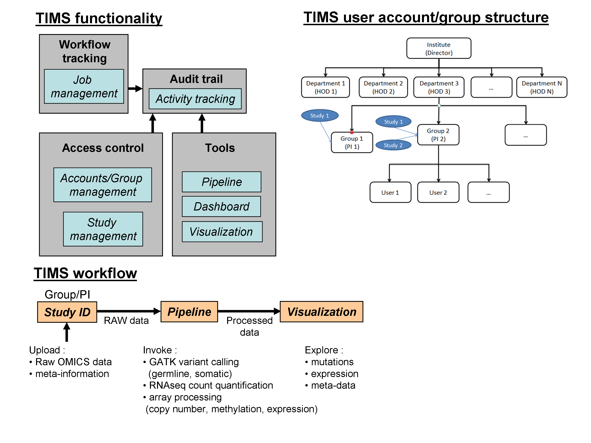

# Summary

With the maturation of sequencing technology over the past decade, the cost  associated to an OMICS based clinical study is no longer a limiting factor even for large cohorts, e.g., the UK's 100K genomes project [@Samuel:2017]. However, the real cost of such a study goes beyond sequencing or data generation in general [@Muir:2016]; the amount of raw sequencing data per sample can be quite sizable and quickly amass to quite a collection even for a modest cohort in contrast to the 
array based technology that it has inevitably displaced.

Often, a poorly tackled area in the post data production of cohort studies is the concerted management of the clinical meta-information (e.g., subjects' demographics, multiple records of domain specific clinical measures and other information) and the associated OMICS datasets over the course of these studies and eventually their long-term curation after their publication. In particular, these voluminous OMICS datasets require heavy preprocessing to obtain analysis-ready format (e.g., gene count quantification, genetic variants and mutations) prior to any phenotype genotype analysis. Another important consideration is the ability to re-process the OMICS datasets with alternative or updated algorithms where multiple datasets may be aggregated to perform analysis to test new hypotheses or to simply affirm the reproducibility [@Fanelli:2018] of the clinical results in a larger set. Although heavier systems (e.g., SysMO SEEK, DIPSBC, openBIS, Gaggle/BRM) do exist, they are not necessarily open source freeware and they often require complex deployment and distributed IT infrastructure [@Wruck:2014].

Specifically, we refer to an OMICS-based clinical data management open-source software that curates study-related clinical information, manages the raw processing of diverse OMICS datasets to a preprocessed analysis ready state and finally visualizes the clinical information and processed output in a single access-controlled and audit trailed environment. Most importantly, this data management system should provide a skeletal open-source software framework for which any appropriate OMICS pipelines and visualizers can be integrated seamlessly in a scaleable fashion. For this purpose, the Translational Informatics Management System (TIMS) software suite was built.

# Functionality and Implementation

The Translational Informatics Management System (TIMS) describes a server-side clinical data management and OMICS production system for human research. From a technical overview, its central design is based on a Model-View-Controller (MVC) design pattern and implemented in Java server Faces (JSF) supplemented by general open source software packages as listed in Figure 1. In particular, GNU trove library and Ominfaces offer higher performance data structures (e.g., map, set, trees) and additional utilities compared with the native Java libraries. Meanwhile, the overall graphical user interface (GUI) is written in JSF with enhanced graphical modules from the PrimeFaces.

TIMS implements four main functions: audit trail (activity tracking), access control (accounts/group management, study management), and workflow tracking (job management) and tools (pipeline, visualization); see Figure 2.

Firstly, the audit trail function captures all users' activities in the system, which includes job submissions, data processing, and any system activities. These information are pushed onto the backend relational database (PostgresSQL) as the system's data store.

Secondly, the access control function manages the users' access privilege based on a hierarchical structure of role/work unit (e.g., Director/Institute, Head/Department, Principal Investigator/Group, User/Group) through the accounts/group management module. Meanwhile, the study management module organizes both clinical and OMICS data into individualized cohort studies which are then assigned to users; all study data sets (both subjects' meta information and preprocessed OMICS datasets) are stored in the PostgresSQL database. Finally, the level of data access is dependent on the specific user's privilege set by the accounts/group management module.

Thirdly, the workflow tracking function is implemented as a job management module to track data production (i.e., from raw data to preprocessed/analysis ready data) of OMICS datasets. Any data production task submission via the appropriate OMICS pipeline will appear as a job under this module with its status (complete, on going) appropriately reflected.

Lastly, the tools function contains tools for pipelines and visualizers. The current pipeline tools are OMICS-centric and convert RAW data to its preprocessed format (see Figure 3 for complete list). Meanwhile, the current visualizer in TIMS (cBioPortal) allows for visualization and query of the preprocessed OMICS data.

# Availability

The software, distributed under the GNU General Public License v3.0, is available at https://github.com/bii-absd/tims, together with the installation guide and tutorials. The demo datasets used in the tutorial are available for download at https://figshare.com/articles/TestData_tar/9083936. A live demo version of TIMS is available at https://tims.bii.a-star.edu.sg/TIMS/login.xhtml.

# Acknowledgements

We acknowledge contributions from Joanne Lee for the testing and documentation of TIMS during the genesis of this project.

# References
